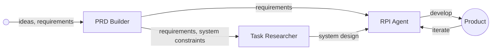

# azure-operations
Operations repo for Azure subs

*Powered by [HVE Core](https://github.com/microsoft/hve-core)*

```mermaid

  flowchart LR
    S(( ))
    A1[PRD Builder]
    A2[Task Researcher]
    A3[RPI Agent]
    O((Product))
    
    S --ideas, requirements--> A1
    A1 --requirements, system constraints--> A2
    A1 --requirements--> A3
    A2 --system design--> A3
    A3 --develop--> O
    O --iterate--> A3
    
```